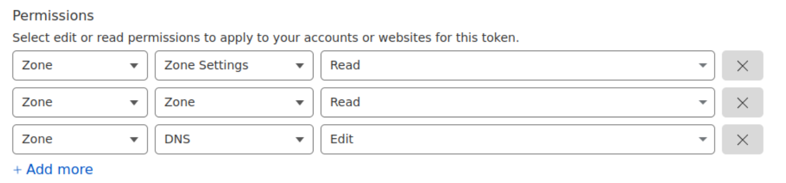

# SETUP

```sh
    MVladislav
```

---

- [SETUP](#setup)
  - [basic](#basic)
    - [create your `secrets`:](#create-your-secrets)
    - [create `.env` file following:](#create-env-file-following)
  - [Cloudflare setup](#cloudflare-setup)
  - [FAQ](#faq)
  - [References](#references)

---

## basic

> defined to work with treafik

### create your `secrets`:

```sh
$echo "<API_KEY>" > config/secrets/api_key_secret.txt
```

### create `.env` file following:

```env
NODE_ID=
NODE_ROLE=manager
NETWORK_MODE=overlay

VERSION=latest

ZONE=example.com
PROXIED=true
RRTYPE=A
PUID=1000
PGID=1000
SUBDOMAIN=office
DELETE_ON_STOP=true
DNS_SERVER=1.1.1.1
```

## Cloudflare setup

create api-token permission like this:



---

## FAQ

- TLD restriction on api
  - the TLDs `.cf, .ga, .gq, .ml, or .tk` are not usable over API

---

## References

- <https://hub.docker.com/r/oznu/cloudflare-ddns/>
- <https://developers.cloudflare.com/fundamentals/get-started/reference/network-ports/>
